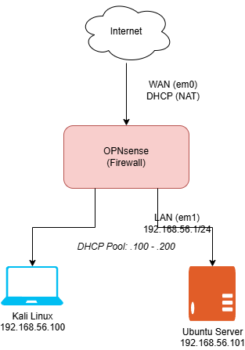

# Homelab — Fase 0: Red segmentada con firewall virtual (OPNsense)

## Objetivo del proyecto

Construir un laboratorio virtual de redes usando VMware Workstation Pro, con una red interna aislada, protegida por un firewall/router virtual (OPNsense), como base para practicar ciberseguridad ofensiva y defensiva, hardening de sistemas, y automatización de redes.

Este es el primer proyecto de un roadmap de aprendizaje práctico enfocado en Redes, Ciberseguridad, IT y Automation.

## Arquitectura



```
Internet
   │
   │ WAN — DHCP (NAT de VMware)
   ▼
┌─────────────┐
│  OPNsense   │  Firewall / Router virtual
│ (Firewall)  │
└──────┬──────┘
       │ LAN — 192.168.56.1/24
       │ DHCP Pool: .100 – .200
   ┌───┴────┐
   ▼        ▼
Kali Linux   Ubuntu Server
192.168.56.100  192.168.56.101
```

*(el diagrama editable en formato `.drawio` está incluido en este repositorio)*

## Tecnologías utilizadas

- **VMware Workstation Pro** — hipervisor de virtualización
- **OPNsense 26.7** — firewall/router open source (fork de pfSense)
- **Kali Linux** — distribución para pruebas de seguridad (rol: atacante/analista)
- **Ubuntu Server LTS 26.04** — servidor objetivo (rol: víctima/servidor a asegurar en la siguiente fase)
- **draw.io** — documentación del diagrama de red

## Configuración de red

| Dispositivo | Interfaz | IP | Rol |
|---|---|---|---|
| OPNsense | WAN | DHCP (vía NAT de VMware) | Salida a internet |
| OPNsense | LAN | 192.168.56.1/24 | Gateway de la red interna |
| Kali Linux | eth0 | 192.168.56.100 (DHCP) | Atacante / herramientas ofensivas |
| Ubuntu Server | eth0 | 192.168.56.101 (DHCP) | Servidor objetivo |

Red virtual VMware usada: **VMnet2 (Host-only)**, con el adaptador virtual del host y el DHCP nativo de VMware **desactivados** — todo el direccionamiento IP lo controla OPNsense, replicando el comportamiento de una red real.

## Cómo se construyó (resumen)

1. Instalación de VMware Workstation Pro.
2. Descarga de Kali Linux (VM preconstruida) y Ubuntu Server LTS 26.04.
3. Descarga de OPNsense CE (elegido sobre pfSense CE por tener descarga directa de ISO sin pasar por tienda/cuenta).
4. Creación de red virtual host-only (VMnet2) en VMware, sin adaptador de host ni DHCP propio.
5. Instalación de OPNsense **al disco** (no en modo live) como VM con 2 interfaces: WAN (NAT) y LAN (VMnet2).
6. Asignación de interfaces WAN/LAN, configuración de IP estática en LAN (192.168.56.1/24) y activación del servicio DHCP (rango .100–.200).
7. Conexión de Kali y Ubuntu Server a la misma red VMnet2.
8. Verificación de conectividad (ping interno, ping a internet) y primer escaneo con `nmap -sn`.
9. Hardening inicial: cambio de contraseña por defecto de OPNsense, revisión de reglas de firewall por defecto.

## Problemas encontrados y cómo se resolvieron

Documentar estos problemas es tan importante como el resultado final — son evidencia real de troubleshooting.

### 1. VirtualBox se congelaba
**Problema:** VirtualBox presentaba cuelgues frecuentes en el equipo host.
**Solución:** se migró todo el laboratorio a **VMware Workstation Pro**, más estable para este caso de uso.

### 2. Descarga de pfSense CE con fricción
**Problema:** el proceso de descarga de pfSense CE cambió y ahora redirige a través de una tienda online (Netgate Installer), generando confusión sobre si era gratuito.
**Solución:** se optó por **OPNsense** en su lugar — mismo propósito (firewall/router open source), descarga directa de ISO sin registro ni tienda.

### 3. Fallo de arranque por memoria insuficiente
**Problema:** la VM de OPNsense quedaba atrapada en una shell de rescate de FreeBSD al arrancar, con errores `Killed` y `Error in early script '15-templates'` — síntoma de un OOM (out of memory) durante la generación de configuración inicial.
**Solución:** se incrementó la RAM asignada a la VM de 1-2GB a 4GB, lo que permitió un arranque limpio.

### 4. Conflicto de IP entre el host y OPNsense
**Problema:** las VMs cliente (Kali, Ubuntu) no recibían IP por DHCP (timeout al solicitarla), a pesar de que OPNsense mostraba la interfaz LAN activa.
**Causa raíz:** VMware reserva por defecto la IP `.1` de la subred host-only para el adaptador virtual del propio equipo anfitrión — la misma IP que se le asignó a OPNsense, generando un conflicto de direccionamiento.
**Solución:** en el Virtual Network Editor de VMware, se desactivó la opción "Connect a host virtual adapter to this network" y "Use local DHCP service to distribute IP addresses to VMs" en VMnet2, dejando que OPNsense sea el único controlador de direccionamiento de esa red.

### 5. Configuración perdida tras reiniciar (modo Live)
**Problema:** toda la configuración de red se perdía después de cada reinicio de OPNsense.
**Causa raíz:** OPNsense estaba corriendo en **"live media mode"** (booteando directamente desde el ISO, sin haberse instalado nunca al disco duro virtual).
**Solución:** se inició sesión con el usuario `installer` (en vez de `root`) desde la pantalla de login, lo cual lanza el asistente real de instalación. Se instaló OPNsense al disco virtual de 20GB usando particionado UFS, y se desconectó el ISO del CD/DVD virtual en VMware para evitar volver a bootear en modo live.

### 6. Configuración accidental de LAGG
**Problema:** al reconfigurar las interfaces tras la instalación, se respondió afirmativamente sin querer a la pregunta de configurar un LAGG (agregación de enlaces), función no necesaria para este laboratorio.
**Solución:** se dejó el campo de miembros del LAGG vacío para no aplicar ninguna agregación, y se continuó con la asignación normal de WAN/LAN.

## Verificación y pruebas

- ✅ `ping 192.168.56.1` desde Kali → OPNsense responde
- ✅ `ping` entre Kali y Ubuntu Server → conectividad interna confirmada
- ✅ `ping 8.8.8.8` desde Ubuntu Server → salida a internet vía NAT confirmada
- ✅ `sudo nmap -sn 192.168.56.0/24` desde Kali → 3 hosts detectados (OPNsense, Kali, Ubuntu Server), confirmando aislamiento correcto de la red

```
Nmap scan report for OPNsense.internal (192.168.56.1)
Nmap scan report for 192.168.56.100 (Kali)
Nmap scan report for 192.168.56.101 (Ubuntu Server)
Nmap done: 256 IP addresses (3 hosts up) scanned
```

## Aprendizajes clave

- Diferencia entre modo "live" y una instalación real en disco, y por qué importa para persistencia de configuración.
- Cómo evitar conflictos de DHCP/IP entre el hipervisor y un router virtual.
- Troubleshooting de conectividad de capa 2 vs. capa 3 (probar con IP estática antes de asumir que el problema es DHCP).
- Configuración de un firewall/router desde cero: asignación de interfaces, direccionamiento estático, y servicio DHCP.

## Próximos pasos

Este entorno es la base para:
- **Fase 1:** Hardening del servidor Ubuntu (UFW/iptables, SSH por llave, fail2ban).
- **Fase 2:** Pentest guiado contra una máquina vulnerable (Metasploitable2) usando Kali.

---
*Proyecto de aprendizaje práctico — Leandro Cabrera, Ingeniero en Telecomunicaciones (UCAB)*
