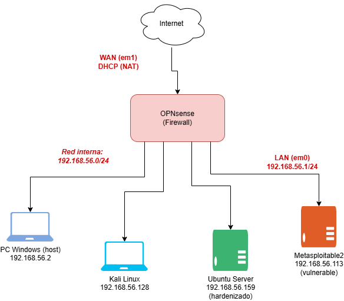

# Homelab — Fase 3: Automatización con Python

## Objetivo del proyecto

Construir un conjunto de herramientas propias de red y seguridad en Python, sin depender de utilidades ya hechas (nmap, fail2ban), para entender a fondo qué hacen esas herramientas "por debajo". Este proyecto conecta directamente con la experiencia previa desarrollando un orquestador en Python durante la pasantía en Bancaribe, aplicando el mismo enfoque a un dominio distinto (redes/seguridad en vez de análisis estático de código).

Construye sobre la infraestructura de la [Fase 0](../fase0-red-segmentada/README.md), el servidor hardenizado de la [Fase 1](../fase1-hardening-linux/README.md), y los hallazgos de explotación de la [Fase 2](../fase2-pentest-metasploitable/README.md).

## Arquitectura

Las 3 herramientas se ejecutaron contra los objetivos ya existentes del laboratorio:



```
Kali Linux (192.168.56.128)
   ├── port_scanner.py    → escaneado contra Ubuntu Server y Metasploitable2
   └── inventario_red.py  → escaneado contra toda la red 192.168.56.0/24

Ubuntu Server (192.168.56.159)
   └── log_parser.py      → ejecutado localmente, analiza /var/log/auth.log
```

## Tecnologías utilizadas

- **Python 3** (librería estándar únicamente: `socket`, `re`, `sqlite3`, `subprocess`, `argparse`, `concurrent.futures`)
- **SQLite** (base de datos embebida, sin servidor externo)
- **SSH/SCP** para mover los scripts entre máquinas del laboratorio

## Las 3 herramientas

### 1. `port_scanner.py` — Port scanner propio

Escanea un rango de puertos TCP usando `socket.connect_ex()`, en paralelo con `ThreadPoolExecutor` (por defecto 100 hilos simultáneos), y captura el "banner" de bienvenida que algunos servicios envían al conectar (SSH, FTP), replicando en pequeño lo que hace nmap con `-sV`.

**Validación:** comparado contra los resultados ya conocidos de nmap en la Fase 1 y 2 — coincidencia exacta contra Ubuntu Server (2 puertos), y prácticamente idéntica contra Metasploitable2 (25 de 26 puertos, diferencia esperable por rango de escaneo). Además, el banner grabbing reveló directamente el prompt de la puerta trasera del puerto 1524 (`root@metasploitable:/#`), mostrando que a veces ni se necesita explotar nada — la información ya está expuesta en el banner.

### 2. `log_parser.py` — Detector de fuerza bruta en logs SSH

Usa expresiones regulares para identificar líneas de intentos fallidos de autenticación en `/var/log/auth.log`, cuenta ocurrencias por IP con `collections.Counter`, y marca como sospechosas las IPs que superan un umbral configurable (por defecto 5 intentos).

**Validación:** se generaron intentos fallidos reales desde Kali y desde OPNsense, y se comparó el resultado contra `fail2ban-client status sshd`. El script detectó correctamente ambas IPs como sospechosas, aunque con un conteo mayor que fail2ban (18 vs. 6) — ver sección de hallazgos para el porqué.

### 3. `inventario_red.py` — Inventario de red con historial

Hace un ping sweep de una subred completa en paralelo, y guarda los resultados en una base de datos SQLite (`inventario_red.db`), distinguiendo entre hosts ya conocidos y hosts completamente nuevos respecto a escaneos anteriores — el mismo concepto detrás de una herramienta de gestión de activos (asset management) en ciberseguridad real.

**Validación:** primera corrida marcó los 4 hosts existentes como nuevos (base de datos vacía). Tras encender Metasploitable2 y correr el script de nuevo, solo esa IP nueva se marcó como `NUEVO`, mientras que las 4 anteriores mantuvieron su registro histórico (`veces_visto` incrementado correctamente a 2).

## Problemas encontrados y cómo se resolvieron

### 1. Confusión sobre en qué máquina ejecutar cada script
**Problema:** al construir `log_parser.py`, no quedaba claro por qué el script debía ejecutarse en Ubuntu Server y no en Kali (donde se había escrito originalmente).
**Causa raíz:** el archivo de log que se analiza (`/var/log/auth.log`) es generado y almacenado por el propio servidor que recibe las conexiones SSH — Kali, al ser quien *inicia* las conexiones, no tiene ese archivo.
**Solución:** se usó `scp` para copiar el script desde el equipo donde fue creado (Windows, vía Git Bash) hacia Ubuntu Server, ejecutándolo ahí con `sudo` (necesario porque `/var/log/auth.log` no es legible por usuarios sin privilegios).
**Aprendizaje:** `scp` siempre se ejecuta parado en la máquina de *origen* (donde el archivo ya existe), nunca en la de destino.

### 2. Discrepancia de conteo entre `log_parser.py` y fail2ban
**Observación:** el script propio contó 18 intentos fallidos totales, mientras que fail2ban solo registró 6.
**Causa raíz:** el script usa varios patrones regex distintos (`Invalid user`, `Failed publickey`, `Connection closed by invalid user`), y una sola conexión SSH fallida puede generar múltiples líneas de log que coinciden con patrones diferentes — resultando en conteo inflado. fail2ban usa expresiones regulares más específicas y depuradas para contar una única vez por conexión real.
**Aprendizaje:** diferencia real entre una herramienta educativa construida para entender un concepto, y una herramienta de producción refinada durante años por una comunidad — ambas tienen valor, pero por razones distintas.

### 3. Confusión entre el módulo `sqlite3` de Python y el comando `sqlite3` de terminal
**Problema:** al intentar consultar la base de datos manualmente con `sqlite3 inventario_red.db "SELECT..."`, apareció el error `Command 'sqlite3' not found`.
**Causa raíz:** son dos herramientas distintas con el mismo nombre — el módulo de Python (`import sqlite3`) viene incluido en la librería estándar y no requiere instalación, pero el cliente de línea de comandos para inspeccionar archivos `.db` manualmente es un paquete de sistema separado.
**Solución:** `sudo apt install sqlite3 -y`.

## El concepto de seguridad más importante de esta fase: SQL Injection

Todas las consultas a la base de datos en `inventario_red.py` usan **parámetros con `?`** (ej. `execute("SELECT ip FROM inventario WHERE ip = ?", (ip,))`) en vez de construir la consulta pegando texto directamente (`f"WHERE ip = '{ip}'"`). Esto previene **SQL Injection**: un ataque donde un valor de entrada malicioso (ej. `x' OR '1'='1`) podría alterar la lógica de la consulta SQL si se concatenara directamente como texto. Es una práctica de seguridad universal en cualquier lenguaje que interactúe con bases de datos.

## Verificación y resultados

- ✅ `port_scanner.py` validado contra resultados conocidos de nmap en 2 objetivos distintos.
- ✅ `log_parser.py` detectó correctamente 2 IPs con comportamiento de fuerza bruta, validado cruzando resultados con fail2ban.
- ✅ `inventario_red.py` detectó correctamente hosts nuevos vs. conocidos a través de múltiples ejecuciones, con persistencia confirmada en SQLite.

## Aprendizajes clave

- Cómo funciona un escaneo de puertos TCP a nivel de sockets (`connect()`, `connect_ex()`, three-way handshake).
- Qué es un banner de servicio y por qué algunos protocolos (SSH, FTP) lo envían sin pedirlo, mientras otros (HTTP) no.
- Uso de `ThreadPoolExecutor` para paralelizar tareas de red y reducir drásticamente el tiempo de ejecución.
- Expresiones regulares para extraer patrones específicos (IPs) de texto no estructurado (logs).
- Diferencia entre herramientas educativas caseras y herramientas de producción maduras, y por qué ambas tienen valor de aprendizaje distinto.
- SQLite como base de datos embebida en un solo archivo, ideal para scripts y proyectos pequeños sin necesidad de un servidor de base de datos separado.
- Prevención de SQL Injection mediante consultas parametrizadas — hábito aplicable a cualquier lenguaje/librería de bases de datos futura.

## Próximos pasos

**Fase 4:** Stack de detección con Docker (Wazuh/ELK), apuntando los logs de este mismo servidor hacia un sistema de monitoreo centralizado, y generando alertas a partir de los mismos patrones que `log_parser.py` detecta manualmente hoy.

---
*Proyecto de aprendizaje práctico — Leandro Cabrera, Ingeniero en Telecomunicaciones (UCAB)*
